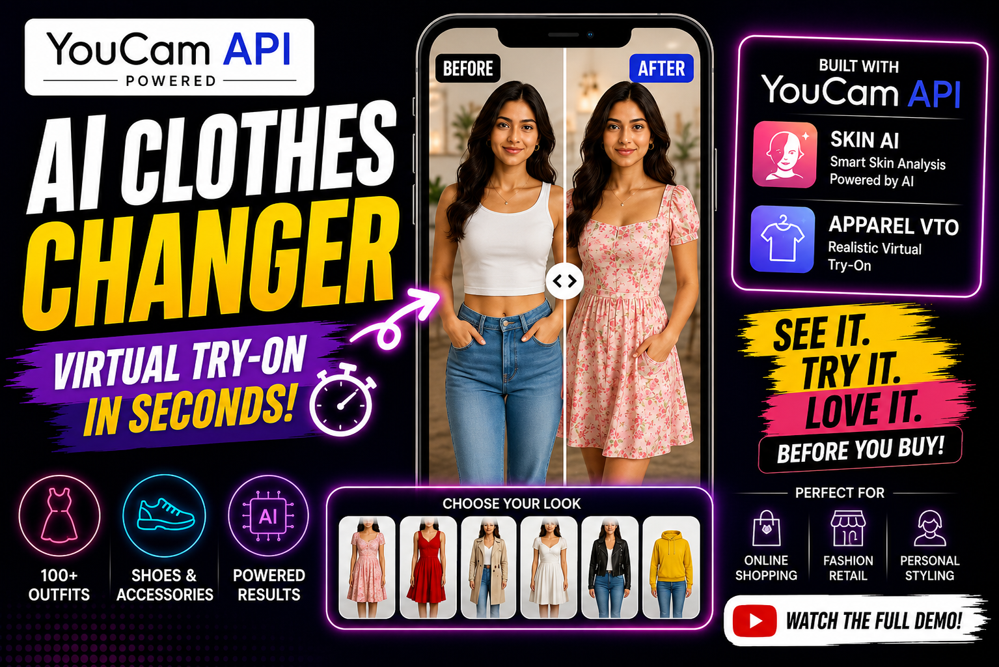
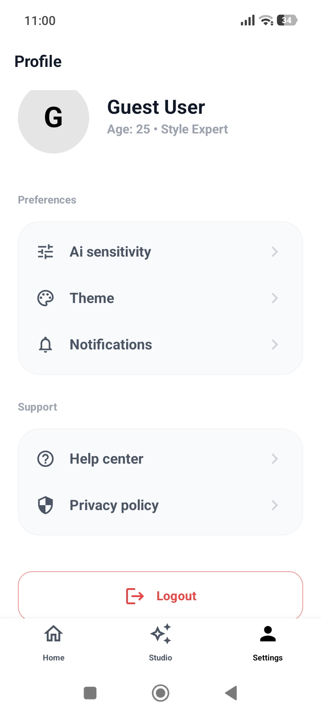
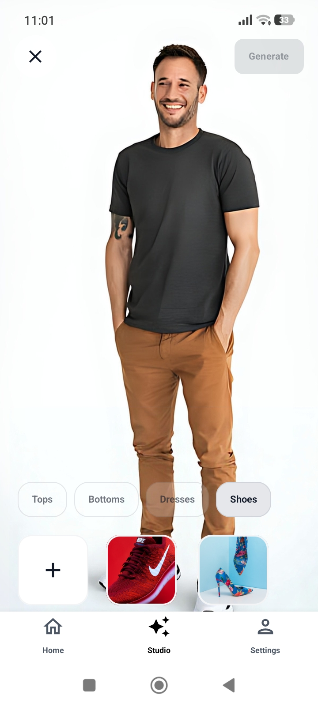
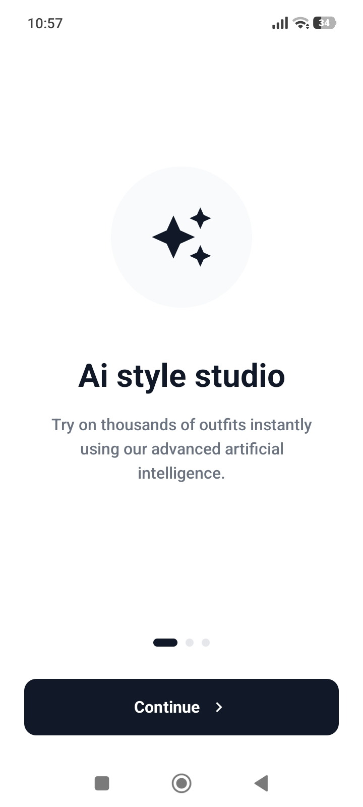
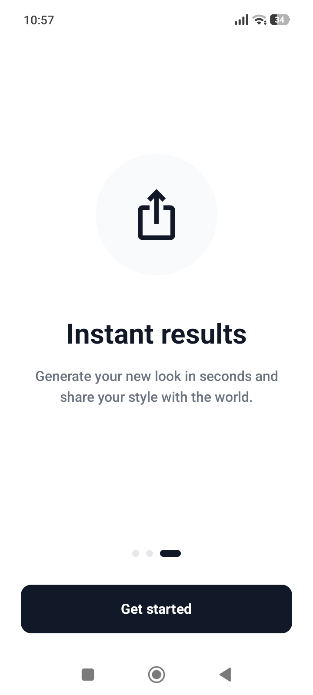

# ✨ GlowUp AI - Your Personal AI Fashion Studio

[](https://kotlinlang.org)
[](https://developer.android.com/jetpack/compose)
[](https://www.android.com)

GlowUp AI is a high-end, professional fashion application that leverages advanced Artificial Intelligence to provide instant virtual try-ons. Experience the future of shopping and personal styling directly from your smartphone.

---

## 📸 Screen Previews

| **Home & Studio** | **AI Try-On Result** | **Onboarding & Profile** |
|:---:|:---:|:---:|
|   |   |   |

---

## 🌟 Key Features

- **🚀 AI Style Studio**: Instantly try on tops, bottoms, dresses, and shoes using the powerful **YouCam AI API**.
- **📁 Digital Closet**: Upload your own garment photos and see how they look on you instantly.
- **✨ Professional UI**: Minimalist, high-contrast white theme designed for a premium user experience.
- **📷 HD Studio Mode**: High-resolution camera integration with easy one-handed controls.
- **🔄 Instant Results**: Compare your "Before" and "After" looks with smooth interactive transitions.

---

## 🛠 Tech Stack

- **Core**: Kotlin & Jetpack Compose (Modern Declarative UI)
- **Architecture**: MVVM with Clean Architecture principles
- **AI Engine**: **YouCam API v2.0 S2S Integration**
- **Backend**: Firebase Storage (Image assets) & Firestore
- **Camera**: CameraX (HD capture & life-cycle aware)
- **Image Loading**: Coil (Optimized image caching)
- **Local Storage**: Jetpack DataStore (Fast, asynchronous preferences)

---

## 🚀 How to Build & Run

Follow these steps to set up the project on your local machine:

### 1. Prerequisites
- Android Studio Ladybug (or newer)
- JDK 17+
- Android SDK 35 (API level 35)

### 2. Clone the Repository
```bash
git clone https://github.com/vishaldev78/GlowupAI.git
cd GlowupAI
```

### 3. Firebase Setup
1. Create a new project in the [Firebase Console](https://console.firebase.google.com/).
2. Add an Android App with package name `com.glowup.ai`.
3. Download the `google-services.json` file.
4. Place the file inside the `app/` directory.

### 4. API Keys
The project uses the YouCam API. Ensure your API keys are correctly configured in:
`app/src/main/java/com/glowup/ai/util/Constants.kt`

### 5. Build
- Sync Project with Gradle Files.
- Select `app` configuration.
- Click **Run** on your physical device or emulator (API 26+).

---

## 📱 Using the App

1. **Onboarding**: Swipe through the professional intro screens to understand the AI features.
2. **AI Studio**: Point the camera (defaults to back camera for high quality) and take a photo.
3. **Select Garment**: Choose from the curated catalog or upload your own using the "Upload" button.
4. **Generate**: Tap "Generate" and wait for the AI to transform your style.
5. **Review & Save**: Compare with your original photo, share your new look, or save it to your gallery.

---

## 🤝 Contribution
Contributions are welcome! Please feel free to submit a Pull Request.

---

## 📄 License
This project is licensed under the MIT License - see the LICENSE file for details.

Developed with ❤️ by [Vishal Dev](https://github.com/vishaldev78)
